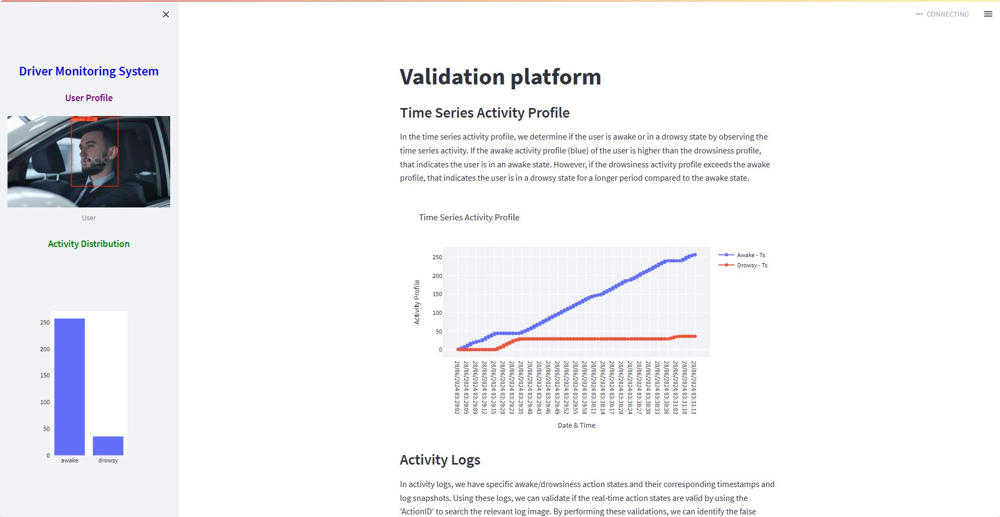

# Drowsiness-DMS-Validation

This repo is a continuation of drowsiness detection for the DMS system. After developing the model, it is important to make validation of these model so, we test the model performance by developing the validation platform.

I have created a video that explains part of the project for the validation of the DMS system using YOLOv8.

)
